# Product Requirement Document: Claude Agent SDK Modernization

**Created**: 2025-12-10
**Version**: 2.0 (Implemented)
**Status**: Complete
**Complexity**: Medium

---

## Executive Summary

This project demonstrates **production patterns for long-horizon AI coding sessions** using the Claude Agent SDK and AWS Bedrock AgentCore. The architecture implements patterns from Anthropic's ["Effective Harnesses for Long-Running Agents"](https://www.anthropic.com/engineering/effective-harnesses-for-long-running-agents) article.

## What Was Built

### Two-Agent Architecture (Orchestrator + Worker)

```mermaid
flowchart TB
    O["🎯 Orchestrator Agent<br/><i>READ-ONLY</i><br/>Tools: Read, Glob, Grep, Task"]
    W["⚙️ Worker Agent<br/><i>Executes tasks</i><br/>Tools: Read, Write, Edit, Bash"]

    O -->|"Task tool"| W
    W -->|"Results"| O
```



**Orchestrator** (READ-ONLY): Reads state files (`tests.json`, `claude-progress.txt`, git logs), selects next feature, delegates ALL modifications to Worker via Task tool.

**Worker** (Subagent): Executes atomic tasks - file operations, bash commands (npm, playwright), screenshot verification.

### System Architecture

```mermaid
flowchart TB
    subgraph AWS["AWS Cloud"]
        subgraph AgentCore["Bedrock AgentCore (ECS Fargate)"]
            Entrypoint["aws_runner.py<br/>(Runtime Entrypoint)"]
            Agent["agent.py<br/>(Session Manager)"]
            subgraph SDK["Claude Agent SDK"]
                Orch["🎯 Orchestrator<br/>(READ-ONLY)"]
                Worker["⚙️ Worker<br/>(Executes tasks)"]
            end
        end
    end

    Entrypoint -->|"spawns subprocess"| Agent
    Agent -->|"creates client"| SDK
    Orch -->|"Task tool"| Worker
```



### Key Relationships

| Component | Role | Relationship |
|-----------|------|--------------|
| `aws_runner.py` | Runtime Entrypoint | Spawns `agent.py` as subprocess |
| `agent.py` | Session Manager | Creates Claude SDK client with two-agent architecture |
| Orchestrator | Coordinator | READ-ONLY, delegates via Task tool |
| Worker | Executor | Performs all file/bash operations |

## Implemented Features

### ✅ F031: SDK Agent Architecture
- `src/agents/base.py` - BaseAgentDefinition class
- `src/agents/worker.py` - WorkerAgent definition
- `src/agents/orchestrator.py` - create_orchestrator_client()
- Two-agent pattern: Orchestrator (READ-ONLY) + Worker

### ✅ F032: SDK Sandbox Security (Foundation)
- `src/sandbox.py` - get_sandbox_settings()
- SandboxSettings configuration
- Existing hooks preserved for validation

### ✅ F033: Structured Output Schemas (Foundation)
- `src/schemas/test_results.py` - TEST_RESULTS_SCHEMA
- `src/schemas/progress_report.py` - PROGRESS_REPORT_SCHEMA
- `src/schemas/build_artifacts.py` - BUILD_ARTIFACTS_SCHEMA

### ✅ F034: Pattern Documentation
- `docs/patterns/README.md` - Overview mapping to article
- `docs/patterns/feature-list.md` - tests.json pattern
- `docs/patterns/progress-tracking.md` - claude-progress.txt pattern
- `docs/patterns/session-recovery.md` - Git recovery pattern
- `docs/patterns/verification.md` - Screenshot workflow pattern

### ✅ F035: SDK Integration Examples
- `examples/basic-orchestrator.py` - Minimal two-agent pattern
- `examples/with-sandbox.py` - SDK SandboxSettings usage
- `examples/structured-outputs.py` - JSON schema validation
- `examples/bedrock-integration.py` - AWS Bedrock configuration

### ✅ F036: Orchestrator Prompt
- `prompts/orchestrator_prompt.txt` - Coordination system prompt

### ✅ F037: README Demo Showcase
- Architecture diagrams showing article patterns
- "About This Demo" section linking to article
- Pattern documentation links

## What Is NOT Implemented

The following from the original v1.0 PRD were **intentionally descoped**:

| Original Feature | Status | Reason |
|-----------------|--------|--------|
| 4+ specialized subagents | ❌ Not implemented | Two-agent pattern is simpler and sufficient |
| Parallel subagent execution | ❌ Not implemented | Sequential delegation works for current needs |
| Research subagent (haiku) | ❌ Not implemented | Worker handles all tasks |
| Code review subagent | ❌ Not implemented | Worker handles all tasks |
| Dynamic agent scaling | ❌ Not implemented | Future enhancement if needed |

## Implementation Files

### New Files Created

```
src/agents/
    __init__.py           # Export agent definitions
    base.py               # BaseAgentDefinition dataclass
    worker.py             # WorkerAgent definition + prompt
    orchestrator.py       # create_orchestrator_client()

src/schemas/
    __init__.py           # Export schemas
    test_results.py       # TEST_RESULTS_SCHEMA
    progress_report.py    # PROGRESS_REPORT_SCHEMA
    build_artifacts.py    # BUILD_ARTIFACTS_SCHEMA

src/sandbox.py            # get_sandbox_settings()

prompts/
    orchestrator_prompt.txt  # Orchestrator system prompt

docs/patterns/
    README.md             # Pattern overview
    feature-list.md       # tests.json pattern
    progress-tracking.md  # claude-progress.txt pattern
    session-recovery.md   # Git recovery pattern
    verification.md       # Screenshot workflow pattern

examples/
    README.md             # Examples overview
    basic-orchestrator.py # Two-agent pattern
    with-sandbox.py       # Sandbox settings
    structured-outputs.py # JSON schemas
    bedrock-integration.py # AWS Bedrock
```

### Modified Files

- `agent.py` - Updated `_create_claude_client()` to use orchestrator pattern

## Article Pattern Mapping

| Article Pattern | Implementation | File Location |
|-----------------|---------------|---------------|
| **Feature List (JSON)** | `tests.json` with pass/fail status | `generated-app/tests.json` |
| **Progress Log** | `claude-progress.txt` for session continuity | `generated-app/claude-progress.txt` |
| **Init Script** | `init.sh` for dev server startup | `generated-app/init.sh` |
| **Git Recovery** | Post-commit hooks, auto-push | `src/git_manager.py` |
| **Session Startup** | State machine reads progress | `agent.py` |
| **E2E Testing** | Playwright screenshot verification | `src/security.py` |
| **Two-Agent Pattern** | Orchestrator + Worker | `src/agents/` |

---

**End of PRD v2.0**
