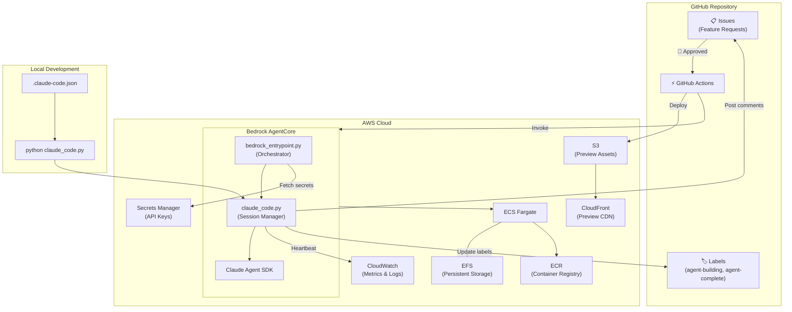
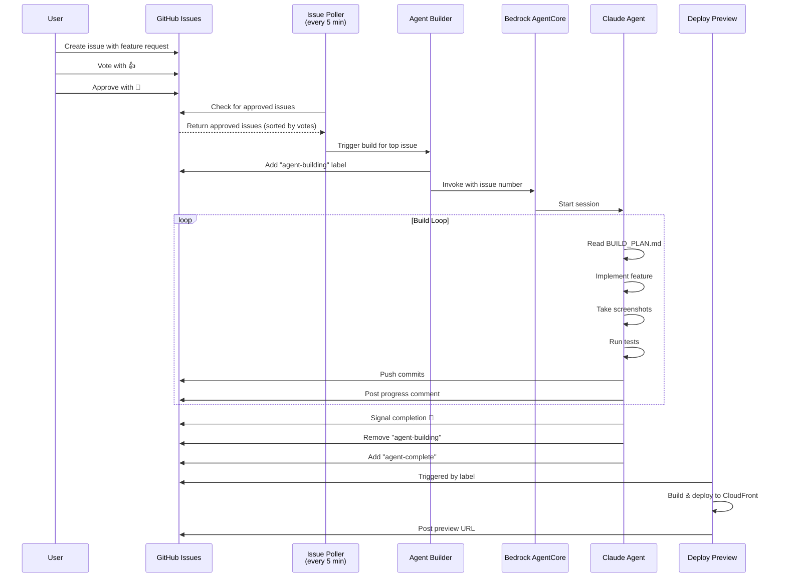
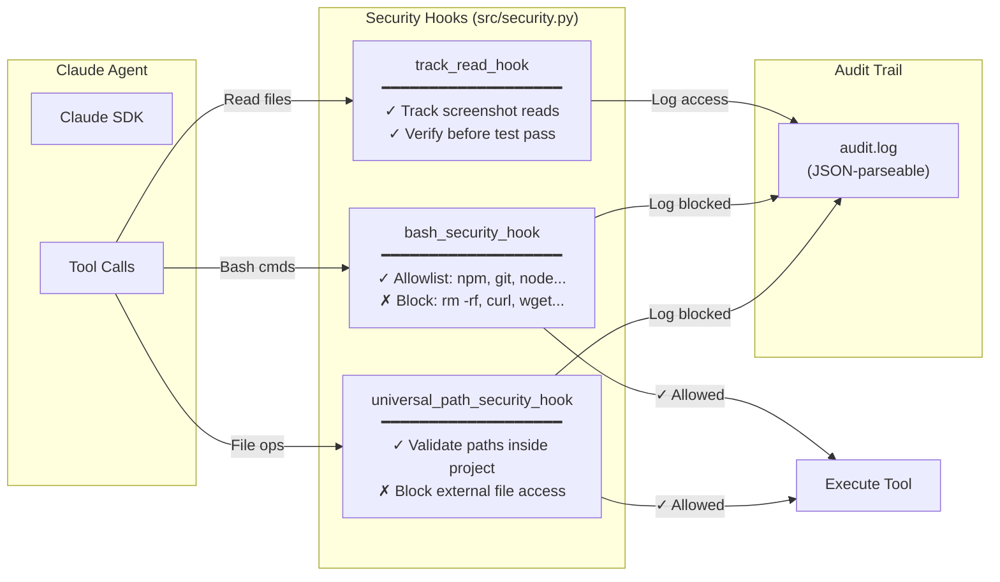
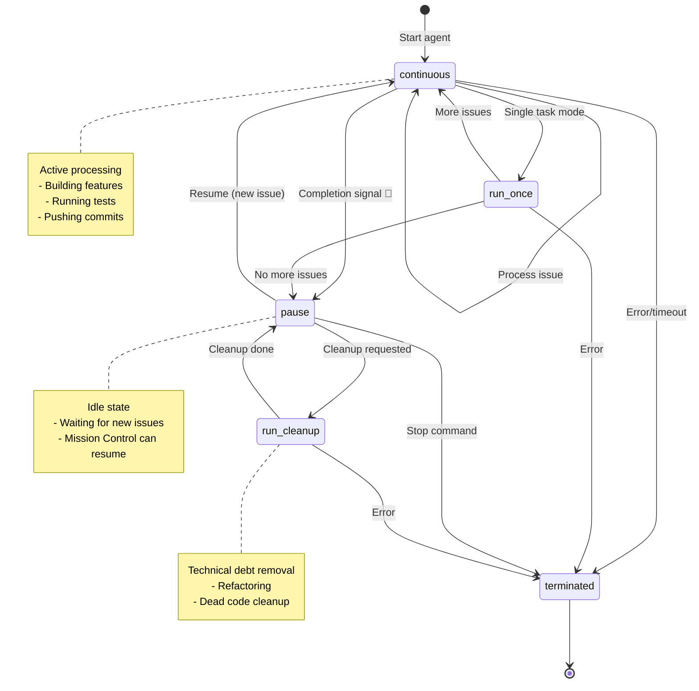

# 🤖 Long-Horizon Coding Agent Demo

An autonomous agent system that builds React applications from GitHub issues using AWS Bedrock AgentCore and the Claude Agent SDK. Demonstrated at AWS re:Invent 2025.

## Architecture

### System Overview



### Issue-to-Deployment Workflow



### Security Model



### Session State Machine



## How It Works

### End-to-End Flow

1. **User creates GitHub issue** with a feature request
2. **Users vote** with 👍 reactions to prioritize what gets built
3. **Authorized user approves** by adding a 🚀 reaction
4. **Issue poller** (runs every 5 min) detects approved issues, sorted by votes
5. **Agent builder** workflow acquires lock and invokes AWS Bedrock AgentCore
6. **Bedrock entrypoint** clones the repo and starts the Claude agent
7. **Agent builds the feature** following the build plan, taking screenshots, running tests
8. **Progress is tracked** via commits pushed to the `agent-runtime` branch
9. **Screenshots and updates are posted** to the GitHub issue
10. **On completion**, the agent signals done, commits are pushed, and `agent-complete` label is added
11. **If more issues exist**, the agent continues in enhancement mode
12. **Deploy preview** workflow builds and deploys to CloudFront

## Key Features

- **Vote-based prioritization** - Issues with more 👍 reactions are built first
- **Health monitoring** - CloudWatch heartbeat detects stale sessions and triggers auto-restart
- **Incremental builds** - Agent builds new features on top of existing generated code
- **Screenshot capture** - Playwright takes screenshots throughout development
- **Live previews** - Each issue gets a CloudFront preview URL

## Quick Start

### Prerequisites

- AWS account with Bedrock AgentCore access
- GitHub repository with Actions enabled
- Python 3.11+ with `uv`

### 1. Install Dependencies

```bash
uv pip install -r requirements.txt
```

### 2. Configure Provider

Run the interactive setup wizard:

```bash
uv run python install.py
```

Select your provider (Anthropic or AWS Bedrock) and follow the prompts.

### 3. Configure GitHub Repository

Set up secrets, variables, and labels for GitHub Actions integration.

See [Configure GitHub Repository](docs/how-to/configure-github-repository.md) for detailed instructions.

### 4. Run Locally

```bash
uv run python claude_code.py --project canopy
```

## Documentation

Detailed how-to guides are available in the [`docs/how-to/`](docs/how-to/) directory:

| Guide | Description |
|-------|-------------|
| [Set Up AWS Bedrock Provider](docs/how-to/setup-bedrock-provider.md) | Configure the agent to use Amazon Bedrock |
| [Configure GitHub Repository](docs/how-to/configure-github-repository.md) | Set up secrets, variables, labels, and AWS Secrets Manager |

### Additional Resources

- [Infrastructure Deployment (CDK)](infrastructure/README.md) - Deploy AWS infrastructure

## Project Structure

```
├── bedrock_entrypoint.py    # Main orchestrator for AWS Bedrock AgentCore
├── claude_code.py           # Agent session manager and local runner
├── src/                     # Python modules
│   ├── cloudwatch_metrics.py  # Heartbeat and metrics
│   ├── github_integration.py  # GitHub API operations
│   └── git_operations.py      # Git commit/push logic
├── prompts/                 # Build plans and system prompts
│   └── canopy/              # Project Management app build plan
├── frontend-scaffold-template/  # React + Vite + Tailwind scaffold
└── .github/workflows/       # GitHub Actions
    ├── issue-poller.yml     # Polls for approved issues
    ├── agent-builder.yml    # Invokes AgentCore
    └── deploy-preview.yml   # Deploys to CloudFront
```

## License

MIT
